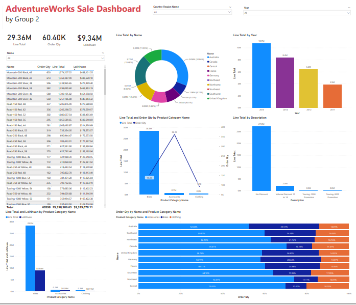

# Portfolio
---
## Data Analytics 

[**Best Linear Regression Model to Predict Car Prices**]

 I want to predict the price of a car using 11 characteristics of the car and identify the characteristics that have the most influence on the price of the car. The best model can be used by auto dealers and buyers to estimate the price for a car with specific characteristics they want to sell/buy.
   
I have built a Linear Regression Model with 2 forms: Simple and Multiple    
With the Simple Linear Regression Model, we choose the feature that has the most influence on the car sales price through the correlation coefficient represented through the Heatmap chart. In conclusion, I chose the variable that has the most influence as Power_perf_factor and the R_squared coefficient is 80.28%    
With Multiple Linear Regression Model, we select the variables into the model through the p-value and test the variables for fit by the VIF coefficient. In conclusion, we can choose 2 variables to be included in the model, Power_perf_factor and Enginesize with adjusted R_squared coefficient of 83.68%.
   
Model: Simple Linear Regression, Multiple Linear Regression
 

---
## Business Intelligence and Decision Support System Project

[**BI Solution for Sales process of AdventureWorks**]

 "The AdventureWorks database is set on the data of a fictional company called Adventure Works Cycles. This is said to be a large-scale multinational manufacturing company. The company manufactures and sells bicycles made of metal and synthetic materials. The company's market includes North America , Europe and Asia."    
We used analytical tools and built charts to:    
• Analyze and evaluate the level of goods consumption of regions and territories.  
• Analyze and determine the purchasing needs of different customer segments, thereby offering different strategies to extract maximum value from customers with high and low profitability.  
• Analyze the quantity of each item in the enterprise; evaluate the business efficiency of each group of products and groups of products in the business process. Thereby promoting the product further.  
• Internally evaluate, improve and optimize capabilities in the sales process, improve efficiency, increase revenue and profit through salespersons analysis.  
• Analyze the effectiveness of the application of promotions and discounts. Thereby promoting effective promotions to help retain customers. 
 

---

© 2022 Tran Truong. Powered by Jekyll and the Minimal Theme.

<!-- Remove above link if you don't want to attibute -->
