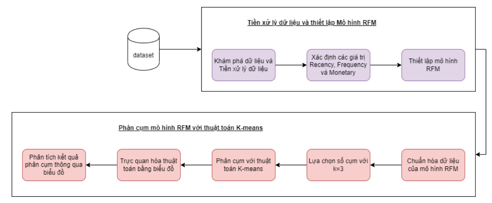
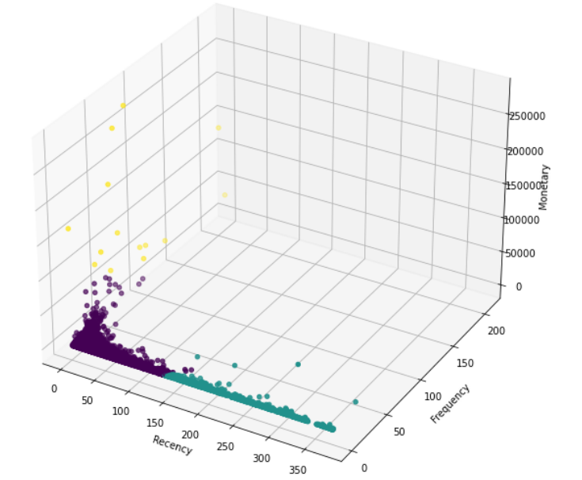
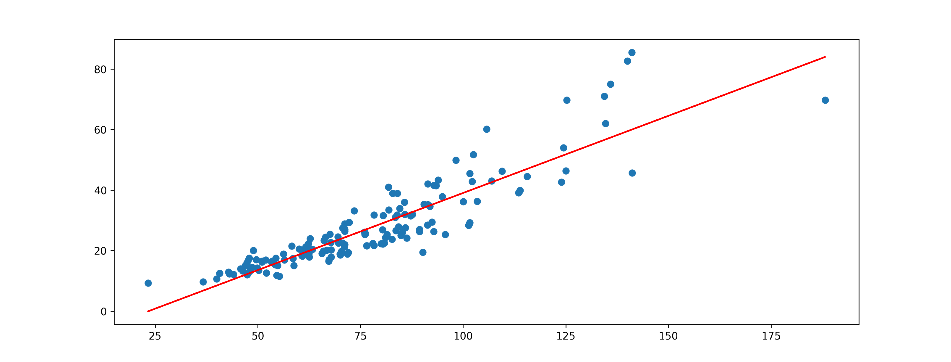
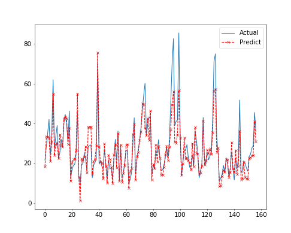
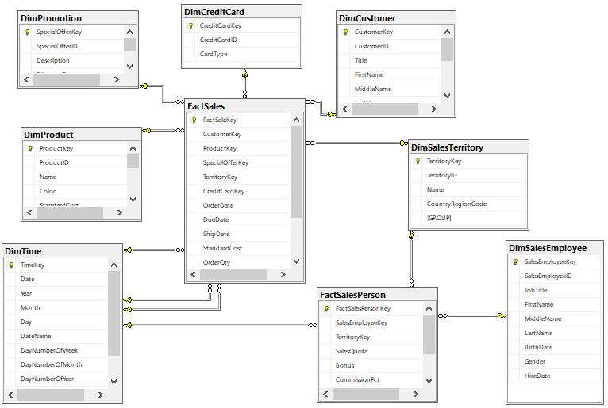
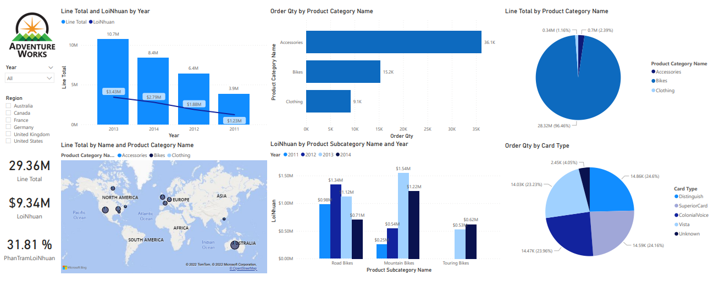

# Portfolio
---
<h1>Big Data</h1>

<h2> RFM Analysis with K-MEANS Cluster by Apache SPARK Tools</h2>

<a href="https://github.com/TruongBaoTran810/Documents/blob/main/RFM_Analysis_by_PySpark-Final.pdf">Report_PDF</a>

 
Using K-means clustering method to divide customer groups based on three factors in RFM method. Each customer segment is now considered a cluster in K-means.  
  Stage 1 collects from the input data a dataset, then explores and preprocesses the data. Then from the necessary attributes from the data set to calculate three important values: Recency, Frequency, Monetary and finally complete the data according to RFM model. Stage 2 is the last stage and also the most complex stage. At this stage, the appropriate methods and models will be selected to solve the input data normalization and implemented the K-Means clustering method to segment customers. From there, giving analysis results, customer group decisions based on K-Means clustering results have been visualized through graphs.  

 
The figure below is a 3D chart of all segmented customers. It can be seen that the density of points of purple and green clusters is relatively stable. As for the yellow cluster, there are fewer and more scattered elements, so it is possible that these are outliers. Therefore, it is very difficult to determine which customer group the yellow cluster is.    
Looking at the predictable 3D graph, the purple cluster group can be the loyal customer group of the business. The most recent purchase date of this customer group is in the best group. This group of customers may be willing to spend more money on activities
shopping action. With the characteristics of Recency, Frequency and Monetary, this is not only a loyal customer group but also a group of potential customers that bring great benefits to businesses.    
With the green cluster, it can be said that this is a fairly large group of customers, this is a common customer group of businesses. In which, the spending level is not too high and lower than the group of loyal customers in purple clusters, but accounts for a relatively high percentage. Regarding the Recency and Frequency values, it remains at a more stable level. With this group of customers, businesses can continue to improve their sales policies to keep this group of customers with them.  

<h1>Data Analytics</h1>

<h2> Best Linear Regression Model to Predict Car Prices </h2>

<a href="https://github.com/TruongBaoTran810/Simple-Linear-Regression-Project/blob/main/simple-linear-regression-by-python.ipynb">Simple-Linear-Regression_Code</a>  
<a href="https://github.com/TruongBaoTran810/Multiple-Linear-Regression/blob/main/multiple-linear-regression-by-python.ipynb">Multiple-Linear-Regression_Code</a>  
<a href="https://github.com/TruongBaoTran810/Multiple-Linear-Regression/blob/main/LinearRegression.pdf">Report_PDF</a>

 I want to predict the price of a car using 11 characteristics of the car and identify the characteristics that have the most influence on the price of the car. The best model can be used by auto dealers and buyers to estimate the price for a car with specific characteristics they want to sell/buy.
   
I have built a Linear Regression Model with 2 forms: Simple and Multiple    
With the Simple Linear Regression Model, we choose the feature that has the most influence on the car sales price through the correlation coefficient represented through the Heatmap chart. In conclusion, I chose the variable that has the most influence as Power_perf_factor and the R_squared coefficient is 80.28%    
With Multiple Linear Regression Model, we select the variables into the model through the p-value and test the variables for fit by the VIF coefficient. In conclusion, we can choose 2 variables to be included in the model, Power_perf_factor and Enginesize with adjusted R_squared coefficient of 83.68%.
   
Model: Simple Linear Regression, Multiple Linear Regression
 

<h1> Business Intelligence and Decision Support System Project </h1>

<h2> BI Solution for Sales process of AdventureWorks </h2> 
 

<a href="https://github.com/TruongBaoTran810/Documents/blob/main/BI_Solution_Presentation.pdf">Presentation_PDF</a>  
<a href="https://github.com/TruongBaoTran810/Documents/blob/main/BI_Solution_Report.pdf">Report_PDF</a>

 "The AdventureWorks database is set on the data of a fictional company called Adventure Works Cycles. This is said to be a large-scale multinational manufacturing company. The company manufactures and sells bicycles made of metal and synthetic materials. The company's market includes North America , Europe and Asia."    
I used analytical tools and built charts to:    
• Analyze and evaluate the level of goods consumption of regions and territories.  
• Analyze and determine the purchasing needs of different customer segments, thereby offering different strategies to extract maximum value from customers with high and low profitability.  
• Analyze the quantity of each item in the enterprise; evaluate the business efficiency of each group of products and groups of products in the business process. Thereby promoting the product further.  
• Internally evaluate, improve and optimize capabilities in the sales process, improve efficiency, increase revenue and profit through salespersons analysis.  
• Analyze the effectiveness of the application of promotions and discounts. Thereby promoting effective promotions to help retain customers. 
 

---

© 2022 Tran Truong. Powered by Jekyll and the Minimal Theme.

<!-- Remove above link if you don't want to attibute -->
